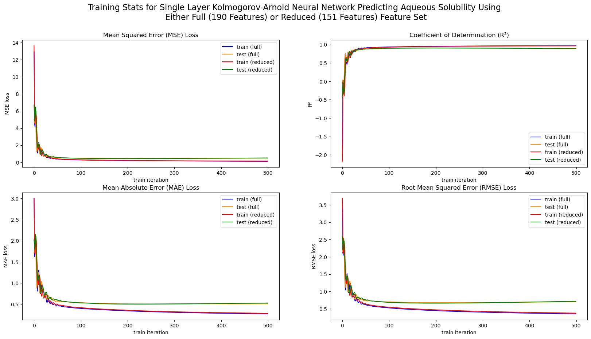

# Applying KANs to Chemical Physics

Kolmogorov-arnold networks (KANs) are a new type of neural network that serves as an alternative to the classic multi-layer perceptron (MLP) which is the basis of most modern large machine learning models.

The basic principle behind KANs is that they learn to approximate a multivariable function by adjusting the weights associated with their activation functions, as opposed to MLPs which typically have static activation functions. As a result, they are potentially easier to interpret and can reveal simple, symbolic models that would be impossible to extract from an MLP.

You can check out the original KAN papers [here](https://arxiv.org/pdf/2404.19756) and [here](https://arxiv.org/pdf/2408.10205). They're lengthy but probably some of my favorite pieces of ML research; very well-explained with informative visualizations from an excellent group of researchers. 

Also, you can view the source code for KANs at [this link](https://github.com/KindXiaoming/pykan). Similar to the paper, it's probably some of the best ML code I've read.

This repository contains my work for an ongoing research project in which I am trying to apply KANs to problems in chemical physics to see if they can uncover or recover simple, explainable, and symbolic models.

Building this in public so I'm forced to write code people can understand \:)



## Motivation

My reasoning for this project is that explainability in chemistry is important; these types of models and their predictions may be used to make decisions about drug design. In order for them to be trustworthy, it may be necessary to sacrifice the performance gains achieved by black-box graph neural nets. But who knows, maybe none of my models will work ¯\\\_(ツ)_/¯

# Instructions

## Building and activating environment

Currently, I use conda to manage dependencies. If you do not already have conda installed, you can view the documentation to install miniconda at [this link](https://docs.anaconda.com/miniconda/).

You can recreate my environment with the following command: 
```bash
conda env create --file requirements.yml
```

Then, to activate the environment, run:

```bash
conda activate cpk
```

## Running tests
Once the environment is built, run unit tests with the command:

```bash
pytest
```

I'll try to test everything not contained in a jupyter notebook so that making future changes will be easier.

## Obtaining Datasets

I expect most of the datasets I used to be public and relatively small, since they'll likely just be lists of SMILES strings and target values. If they're too large for github (> 150 mb), I'll provide instructions for how to obtain them. Otherwise, they'll be contained in `datasets/`

# Project Structure

- `datasets/` - All datasets. If a dataset is too large or not public, will include instructions in an appropriately titled .txt
- `exercises/` - My own personal exercises (mainly implementing things from scratch for better understanding)
- `images/` - Miscellaneous images (mostly for readme)
- `notebooks/` - All jupyter notebooks applying KANs to datasets.
  - `aqueous_solubility_delaney/` - Specific notebooks applying KANs to a dataset from [this paper](https://pubs-acs-org.pallas2.tcl.sc.edu/doi/10.1021/ci034243x) which provides a model for molecular aqueous solubility.
- `tests/` - Unit tests. The structure of the unit test directories will mirror the structure of the project as a whole.
- `train_scripts/` - Full model training pipelines.
- `utils/` - All utility functions and classes
- `requirements.yml` - Project environment requirements.
